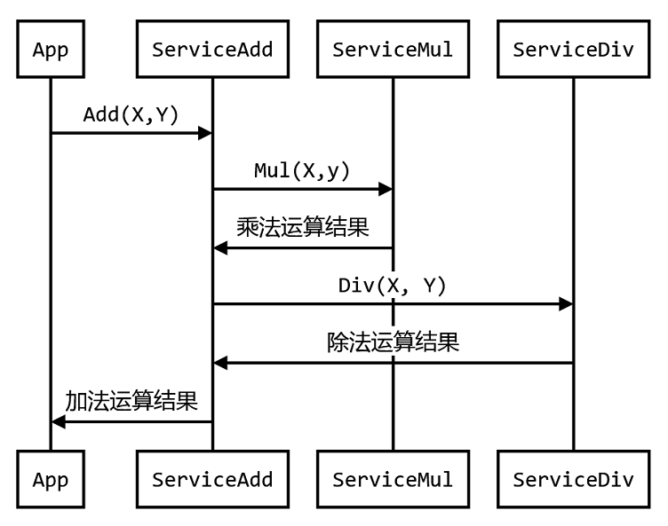
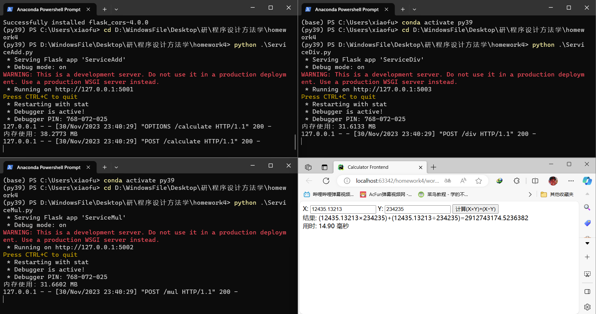

# 作业四、分布式程序设计

### 题目:

**1.假设有3个相互独立的服务A、B和C，可分别用来计算两个双精度实数的加法、乘法和除法运算。**
**2.请通过加法运算服务，完成两个双精度实数的运算。运算表达式如下:**
$$
(X \times Y) + (X \div Y)
$$
**要求**
**1.服务请求按给定序列进行**



其中，App表示客户端程序，ServiceAdd、ServiceMul和ServiceDiv分别表示三个运算服务器。

**2.检测加法服务的请求响应时间。**


### 分析

- 如何实现分布式？
  - 分设三个不同服务器来处理不同的服务。
- 除法运算必须考虑除数为0的情况。
- 考虑在等待乘法运算结果返回时可以同时提交除法请求。
  - 使用异步。

### 设计(使用python的flask框架)

- 编写各个服务代码。
  - 乘法、除法：
    - 获取两个数字，分别返回乘法或除法结果。
    - 当除法除数为零时返回错误信息。
  - 加法服务器：
    - 一个与其他服务器相同的add方法。
    - calculate方法，异步发送乘法和除法请求给两个服务器，等待结果到达后计算加法结果并返回。
- 前端：
  - 输入框用来输入X和Y值，点击按钮计算结果。
  - 发送到服务器前检查输入格式问题。
  - 发送请求给服务器并开始计时。
  - 接收服务器返回结果并结束计时显示结果。

### 主要代码

加法服务器中的响应请求

```python
async def call_multiply_service(operand1, operand2):
    url = "http://127.0.0.1:5002/mul"
    data = {'operand1': operand1, 'operand2': operand2}

    async with aiohttp.ClientSession() as session:
        async with session.post(url, json=data) as response:
            result = await response.json()
            return result.get('result', 0)

async def call_divide_service(operand1, operand2):
    url = "http://127.0.0.1:5003/div"
    data = {'operand1': operand1, 'operand2': operand2}

    async with aiohttp.ClientSession() as session:
        async with session.post(url, json=data) as response:
            result = await response.json()
            if 'error' in result:
                raise ValueError(result['error'])
            return result.get('result', 0)
        
@app.route('/calculate', methods=['POST'])
async def calculate():
    data = request.get_json()
    operand1 = data.get('operand1', 1)
    operand2 = data.get('operand2', 1)

    try:
        # 异步调用乘法服务和除法服务
        mul_result, div_result = await asyncio.gather(
            call_multiply_service(operand1, operand2),
            call_divide_service(operand1, operand2)
        )

        # 计算加法结果
        result = mul_result + div_result

        print(u'内存使用：%.4f MB' % (psutil.Process(os.getpid()).memory_info().rss / 1024 / 1024))
        return jsonify({'result': f"({operand1}×{operand2})+({operand1}÷{operand2})={result}"})

    except ValueError as e:
        return jsonify({'error': str(e)})
```

前端页面中的响应请求

```javascript
function calculate() {
            const operand1 = document.getElementById('operand1').value;
            const operand2 = document.getElementById('operand2').value;

            // 检查输入是否是数字
            if (!operand1 || !operand2 || isNaN(operand1) || isNaN(operand2)) {
                alert('请输入正确的数字！');
                return;
            }
            // 记录开始时间
            const startTime = performance.now();

            // 发送数据到后端进行计算
            fetch('http://127.0.0.1:5001/calculate', {
                method: 'POST',
                headers: {
                    'Content-Type': 'application/json',
                },
                body: JSON.stringify({
                    operand1: parseFloat(operand1),
                    operand2: parseFloat(operand2),
                }),
            })
            .then(response => response.json())
            .then(data => {
                // 计算用时
                const endTime = performance.now();
                const elapsedTime = endTime - startTime;
                document.getElementById('result').innerText = `结果: ${data.result || data.error}`;
                document.getElementById('time').innerText = `用时: ${elapsedTime.toFixed(2)} 毫秒`;
            })
            .catch(error => console.error('Error:', error));
        }
```


### 测试



### 程序质量分析

- 效率（时空开销）：
  - 总耗时14.90毫秒
- 资源（计算和存储空间）：
  - 加法服务器占用内存38.2773 MB
  - 乘法服务器占用内存31.6602 MB
  - 除法服务器占用内存31.6133 MB