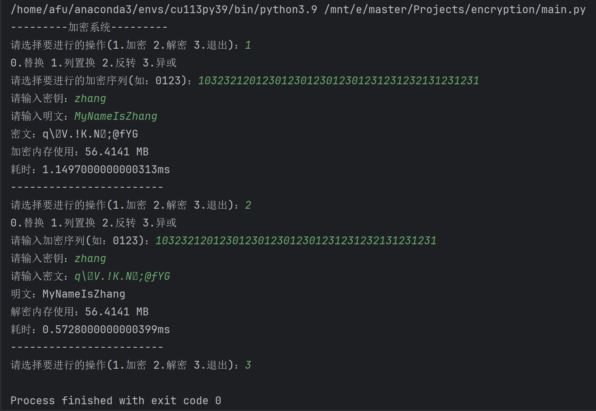

# 作业三：多重加密程序

## 任务描述
- 一个加密器是采用一种预定算法（ 例如:异或、反转、替换、列置换等），依据密钥对给
  定的明文进行加密。
- 假设需要使用至少2种简单的加密器完成对一个明文的多重加密。
- 用户可以指定待使用的加密器的序列。

### 分析

- 如何依次进行加密？
  - 使用面向对象的多态性质，对加密器序列依次调用其加密方法
- 知道加密序列后如何解密？
  - 将加密序列进行反转，而后依次调用解密方法

### 设计

- 首先设计一个加密器抽象类，包含加密和解密的抽象方法和按加密器序列依次加密和解密的静态方法，各个加密器继承此父类。
  - 按加密器序列依次加密和解密：
    - 输入加密器的类序列，依次实例化子类对象，而后对明文或密文依次加密或解密。

- 编写各个加密器子类。

  - 列置换：

    - 加密：

      1.将明文填充为key长度的倍数的数组。

      2.将数组转换为n行key列的矩阵。

      3.将矩阵按key的字符顺序进行列置换。

      4.将矩阵按列输出为密文。

    - 解密：

      1.将密文转换为key行n列的矩阵，而后进行转置。

      2.将矩阵的字符顺序进行key字符顺序的逆置换。

      3.将矩阵按行输出为明文。
      
      
  
  
  - 替换：
  
    - 加密：将明文大小写互换并向右移动key长度
  
    - 解密：将密文大小写互换并向左移动key长度
    
        
  

  - 反转：

    - 加密、解密：将字符串翻转

      

  - 异或：
  
    - 加密、解密：
  
      1.将key填充为明文长度的字符串。
  
      2.获取key与明文的ASCII值并进行异或。

### 代码

见文件

### 测试

### 程序质量分析

- 效率（时空开销）：
  - 加密程序耗时1.14毫秒
  - 解密程序耗时0.57毫秒
- 资源（计算和存储空间）：
  - 加密程序进行加密时占用内存56.4141MB
  - 解密程序进行解密时占用内存56.4141MB